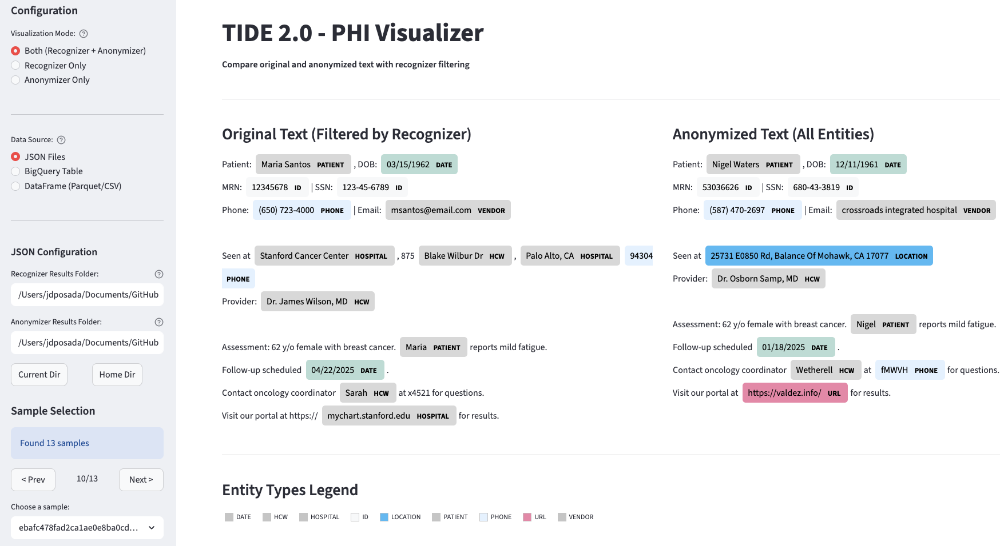

# TIDE 2.0

This will be the public release repo of TiDE 2.0. It is currently *private*.

Do not make public until repo has been sanitized, validated, and contains the security checks required by sponsor.

A data de-identification and anonymization toolkit that combines multiple anonymization strategies with cryptographic techniques and machine learning-based entity recognition.

## Get Started

### Dev Container (recommended)

The repository includes a [Dev Container](https://containers.dev/) configuration that sets up
the full development environment automatically: Python 3.12, `uv`, all dependencies (including
GPU group), pre-commit hooks.

**Prerequisites:**
- [Docker](https://docs.docker.com/get-docker/)
- [VS Code](https://code.visualstudio.com/) with the [Dev Containers extension](https://marketplace.visualstudio.com/items?itemName=ms-vscode-remote.remote-containers)

**Steps:**

1. Clone the repository and open it in VS Code:
   ```bash
   git clone https://github.com/susom/tide2.git
   cd tide2
   ```
2. When VS Code detects `.devcontainer/devcontainer.json`, click **Reopen in Container**
   (or run the command **Dev Containers: Reopen in Container** from the command palette).
3. The virtual environment at `/opt/tide2/.venv` is activated by default in all terminals.

The Dev Container includes these VS Code extensions pre-installed: Python, Ruff, Jupyter,
Docker, and TOML support.

### Local Installation (without Dev Container)

If you prefer to develop outside the Dev Container:

```bash
# Install uv (https://docs.astral.sh/uv/getting-started/installation/)
# macOS and Linux
curl -LsSf https://astral.sh/uv/install.sh | sh

# Clone and install
git clone https://github.com/susom/tide2.git
cd tide2

uv python install 3.12.8
uv sync

# Activate the virtual environment before running any Python commands
source .venv/bin/activate          # macOS / Linux
# .venv\Scripts\activate           # Windows (PowerShell)
```

### Quick Start: Interactive Tutorial

The tutorial notebook walks you through the de-identification pipeline step by step.

**In the Dev Container (or local VS Code):**

1. Open `notebooks/tide2_pipeline.ipynb` (the Jupyter extension is pre-installed in the Dev Container)
2. When prompted for a kernel, select the `.venv (Python 3.12)` environment

**Jupyter in the browser (local installation):**

```bash
uv sync --group dev              # Install Jupyter (dev dependency group)
source .venv/bin/activate
jupyter notebook notebooks/tide2_pipeline.ipynb
```

View the notebook on GitHub: [TIDE 2.0 Pipeline Tutorial](https://github.com/susom/tide2/blob/main/notebooks/tide2_pipeline.ipynb)

**Troubleshooting:**
- **Run from the repo root** — launch Jupyter from the `tide2/` directory so that relative paths resolve correctly.
- **GCP credentials are not required** — the notebook downloads the transformer model from HuggingFace Hub by default. Set `project_id` and `bucket_name` in the Configuration cell only if you want to use GCS-hosted weights.
- **Kernel crashes** — if the Jupyter kernel crashes repeatedly, restart Jupyter (`Ctrl+C`, then re-launch) and run the cells from the top.

### Visualizer Preview

TIDE 2.0 includes a Streamlit visualizer for comparing original and de-identified text side by side:



Launch it with:
```bash
tide2-visualizer
```

To stop the visualizer, press `Ctrl+C` in the terminal (works on macOS, Linux, and Windows).

---

## Overview

TIDE 2.0 is a Python package for anonymizing sensitive data in healthcare and research contexts. It identifies and anonymizes personally identifiable information (PII) while maintaining data utility for analysis and research.

## Features

### Entity Recognition
- **Transformer-based NER**: HuggingFace transformer models with direct batch inference (bypasses HF pipeline), BIO token aggregation, and chunk-to-document reassembly
- **Regex recognizers**: Phone, URL/IP, Email, SSN, Address — replacements for Presidio defaults (10-100x faster)
- **Healthcare-specific**: MRN, Accession Number, HAR code recognizers
- **Known values detection**: Aho-Corasick based matching against patient databases
- **Specialized**: Base64 image detection, genetic sequence detection, LLM-based JSON recognizer
- **Cached results**: Pre-computed NER results from GPU batch processing via `CachedResultsTransformerRecognizer`
- **Presidio Integration**: Built on Microsoft's Presidio framework

### Anonymization Strategies
- **HIPS (Healthcare Identity Protection System)**: Cryptographic deterministic anonymization for names, locations, and alphanumeric identifiers
- **Accession number hashing**: SHA256-based, compatible with BigQuery UDF
- **Faker Integration**: Realistic fake data generation
- **Date Jittering**: Deterministic, privacy-preserving date shifts derived from patient keys
- **Age Grouping**: Age range categorization

### Cryptographic Protection
- **Format-Preserving Encryption (FPE)**: Maintains data format during encryption
- **Key Management**: Key generation, storage, and derivation utilities
- **Deterministic date jitter**: Batch-capable date shift derivation from cryptographic keys
- **String Selection**: HMAC-based cached string selection

### Ray-based Batch Processing
- **Runner module**: Single-node job runner with local and VM modes via `tide2-runner` CLI
- **Ray actors**: `RecognizerActor`, `AnonymizerActor`, `TransformerInferenceActor`, `BIOAggregationActor`, `ReassemblyActor` for `ray.data.map_batches`
- **Two-stage GPU/CPU pipeline**: GPU inference returns raw BIO tokens; CPU actors aggregate them concurrently via Ray Data streaming
- **Direct inference**: Bypasses HuggingFace pipeline dispatch loop with batch tokenize → single GPU forward pass → offset-based extraction
- **Adaptive GPU batching**: Auto-computes batch size from model config and free GPU memory; adjusts based on text lengths with VRAM-aware budgets (override via `--short-seq-budget`)
- **OOM recovery**: Automatic batch splitting on CUDA out-of-memory errors
- **Fault tolerance**: Actor restarts, task retries, graceful shutdown
- **YAML config**: All CLI arguments can be specified in a YAML config file (`--config`)

### Utilities
- **Text processing**: Text chunking, BIO aggregation, span reconstruction, deduplication
- **String parsers**: Name parsing/classification, address parsing, format detection
- **Span metrics**: Gold vs ML evaluation, O(n log n) conflict resolution
- **GCS cache**: Auto-download models from GCS to `~/.cache/tide2/`
- **Model compilation**: `torch.compile` with mega-cache support for faster inference startup

### Command Line Tools
- **`tide2-runner`**: Ray-based single-node job runner with six job types: `recognizer`, `anonymizer`, `transformer`, `reassembly`, `pipeline` (full end-to-end), and `llm-recognizer`. Supports YAML config files and dry-run mode.
- **`tide2-prefect`**: Deploys the TIDE flows to a Prefect work pool (`deploy`, `setup-infra` subcommands). Configures GCS result storage, a zombie-flow automation, and registers the `tide2-main` deployment.
- **`tide2-visualizer`**: Streamlit app for side-by-side PHI comparison and entity editing.


### Cloud Integration
- **GCS**: input/output I/O, model caching, Prefect result storage.
- **BigQuery**: Prefect tasks for exporting notes/recognizer/anonymizer inputs, uploading parquet, importing results back to BigQuery, and cleaning up temp resources (`src/tide2/workflows/tasks/bigquery.py`).
- **GCP Managed Lustre** PVC mounted at `/data` for fast cross-stage scratch storage.
- **Automatic Caching**: Download and cache models from GCS automatically (`$TIDE_CACHE_DIR`).

## CLI Usage

### Runner CLI (Ray-based processing)

```bash
# Run recognition locally
tide2-runner run recognizer -i ./data/input -o ./data/output

# Run on a VM with more resources
tide2-runner run recognizer --mode vm -i gs://bucket/input -o gs://bucket/output \
    --num-cpus 224 --num-actors 200

# Run transformer NER on GPU
tide2-runner run transformer -i ./data/input -o ./data/transformer_output \
    --model StanfordAIMI/stanford-deidentifier-v2 --batch-size 2048

# Run transformer with YAML config
tide2-runner run transformer --config config.yaml

# Run the full pipeline (transformer -> recognizer -> anonymizer)
tide2-runner run pipeline -i ./data/input.parquet -o ./data/output \
    --model StanfordAIMI/stanford-deidentifier-v2

# If you are running on Mac, you can use --object-store-gb option to set
tide2-runner run pipeline -i ./data/input.parquet -o ./data/output \
     --model StanfordAIMI/stanford-deidentifier-v2  --object-store-gb 2

# Run anonymization
tide2-runner run anonymizer -i ./data/recognized -o ./data/anonymized \
    --salt /path/to/salt.bin --key /path/to/key.bin
```


### Interactive Visualizer

```bash
# Launch the Streamlit PHI visualizer
tide2-visualizer
```

## Docker Images

Two production targets are built from a single multi-stage `Dockerfile`:

- `production-cpu` — slim CPU-only image (no CUDA, no `gpu` dependency group). Used by orchestrator, recognizer, anonymizer, and BigQuery tasks.
- `production` — GPU image based on `nvidia/cuda:13.0.2-cudnn-runtime-ubuntu24.04`, includes the `gpu` dependency group (`torch`, `transformers`, `spacy`). Used by transformer and diagnostics flows.
- `development` — Dev Container target with `git`, `gcloud`, build tools, and the full dev environment.

Build and push both images (requires `DOCKER_REGISTRY`, `DOCKER_IMAGE_CPU`, `DOCKER_IMAGE_GPU` in `.env`):

```bash
make docker         # build + push both CPU and GPU images
make docker-cpu     # CPU only
make docker-gpu     # GPU only
```

## Dependency Groups

- **`dev`**: Development tools (`pytest`, `pytest-cov`, `mypy`, `ruff`, `pre-commit`), Jupyter, evaluation libraries (`scikit-learn`, `scipy`, `umap-learn`)
- **`test`**: Minimal test dependencies (`pytest`, `pytest-cov`)
- **`docs`**: API documentation generation (`pdoc`)

Install specific groups with `uv sync --group <name>` or all groups with `uv sync --all-groups`.

Note: GCP, CLI, and ML dependencies are included in the main package by default.

## Architecture

```
tide2/
├── recognizers/              # PII detection (Presidio EntityRecognizer subclasses)
├── anonymizers/              # PII replacement (Presidio Operator subclasses)
├── transformers/             # Core NER inference engine (TransformerCore)
│   ├── core.py              # Model loading, direct inference, BIO aggregation
│   └── config.py            # Model configuration management
├── actors/                   # Ray actors for distributed batch processing
│   ├── transformer.py       # GPU inference actor + CPU BIO aggregation actor
│   ├── recognizer.py        # CPU recognizer actor
│   ├── anonymizer.py        # CPU anonymizer actor
│   ├── reassembly.py        # Chunk-to-document reassembly actor
│   └── llm_recognizer.py    # LLM-based recognizer actor
├── cryptographic/            # FPE, key management, date jitter derivation
├── string_parsers/           # Name/address parsing, format detection
├── runner/                   # Ray-based single-node job runner + CLI
│   ├── local_runner.py      # LocalJobRunner: transformer/recognizer/anonymizer/reassembly/pipeline/llm
│   ├── cli.py               # tide2-runner CLI with YAML config support
│   ├── transformer.py       # Document chunking and reassembly logic
│   ├── fault_tolerance.py   # Actor restarts, graceful shutdown
│   └── utils.py             # Runner utilities
├── cli/                      # Streamlit visualizer
├── utils/
│   ├── gcs_resource_manager.py  # GCS auto-download and caching
│   ├── gcs_connector.py        # GCS file I/O
│   ├── span_metrics.py         # Evaluation metrics and conflict resolution
│   ├── text_processing.py      # Chunking, BIO aggregation, span reconstruction
│   ├── serialization.py        # RecognizerResult <-> dict conversions
│   ├── llm_model.py            # LLM client utilities
│   ├── batch_columns.py        # Batch column constants
│   ├── constants.py            # Shared constants
│   └── resource_utils.py       # Resource path helpers
└── resources/                # Config files (model configs, name lists, etc.)
```

## Testing

```bash
# Run all unit tests (coverage report prints automatically)
uv run pytest

# Run without coverage (faster, useful when debugging)
uv run pytest --no-cov

# Run a specific test file
uv run pytest tests/test_text_processing.py

# Skip slow integration tests
uv run pytest -m "not integration"
```

Coverage is configured in `pyproject.toml` and runs automatically with `pytest`. Three reports are generated on each run:

- **Terminal**: line-by-line missing coverage printed to stdout
- **HTML**: detailed report at `htmlcov/index.html`
- **XML**: `coverage.xml` (Cobertura format, used for badge generation)

### Updating the coverage badge

After running tests, regenerate the badge SVG:

```bash
genbadge coverage -i coverage.xml -o coverage-badge.svg
```

The badge in the README references `coverage-badge.svg` at the repo root. Commit the updated SVG to keep the badge current.

## Documentation

### API Reference

API documentation is hosted via GitHub Pages: [https://susom.github.io/tide2/](https://susom.github.io/tide2/)

To build or preview docs locally (generated with [pdoc](https://pdoc.dev/)):

```bash
# Install docs dependencies
uv sync --group docs

# Live preview (opens a local server with hot reload)
make docs-serve

# Generate static HTML to docs/
make docs

# Deploy to GitHub Pages (builds and pushes to gh-pages branch)
make docs-deploy
```

### Other Resources

- **Examples**: Check the `notebooks/` directory for usage examples
- **Tests**: Test suite in `tests/` directory

## Requirements

- **Dev Container**: Recommended — provides the full environment with no manual setup (requires Docker and VS Code with the Dev Containers extension)
- **Python**: 3.12 (required, `>=3.12,<3.13`) — constrained to 3.12 because several dependencies (`spacy`, `thinc`, `blis`) are built from source and require 3.12-compatible C extensions. RAPIDS GPU libraries (`cudf`, `cuml`, `cugraph`) also pin to 3.12.
- **Package Manager**: uv (not pip or poetry)
- **Virtual Environment**: `.venv/` (activated automatically in the Dev Container; must be activated manually for local installs)
- **Core Dependencies**: Presidio, Ray (`>=2.54`), Cryptography, Faker, Google Cloud libraries; `torch`/`transformers`/`spacy` in the optional `gpu` group

## Security Considerations

- Cryptographic operations use standard libraries (cryptography, pyca/cryptography)
- Format-preserving encryption maintains data format during encryption
- Key management supports generation, storage, and rotation
- Anonymization strategies are designed to prevent re-identification

## Contributing

See the [Dev Container setup](#dev-container-recommended) above for the development environment. Guidelines:

- Code style and testing requirements are enforced by pre-commit hooks (installed automatically in the Dev Container)
- Run `pytest` to verify changes before submitting pull requests

## License

This project is licensed under the MIT License - see the [LICENSE](LICENSE) file for details.

## Citation

If you use TIDE 2.0 in your research, please cite:

```bibtex
@software{tide2,
  title={TIDE 2.0: Data De-identification and Anonymization Toolkit},
  author={TIDE 2.0 Team},
  year={2025},
  url={https://github.com/susom/tide2}
}
```

## Support

- **Issues**: [GitHub Issues](https://github.com/susom/tide2/issues)
- **Discussions**: [GitHub Discussions](https://github.com/susom/tide2/discussions)
- **Development**: See the Contributing section above

---

**Synthetic Data Notice**: All sample data included in this repository (under `notebooks/sample_data/`) is entirely synthetic and fabricated. No real patient data is included. See [`notebooks/sample_data/README.md`](notebooks/sample_data/README.md) for details.

**Note**: This toolkit is designed for research and development purposes. Please ensure compliance with relevant privacy laws and regulations (HIPAA, GDPR, etc.) when using in production environments.
