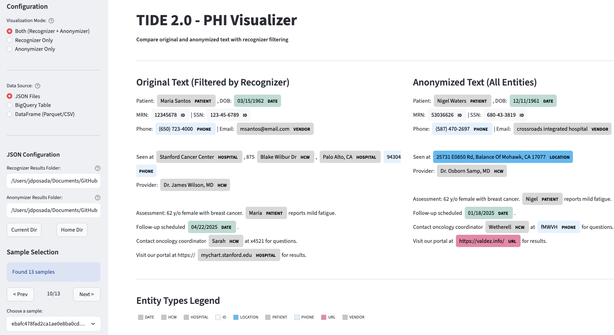

# TIDE 2.0

A data de-identification and anonymization toolkit that combines multiple anonymization strategies with cryptographic techniques and machine learning-based entity recognition.

## Get Started

### Dev Container (recommended)

The repository includes a [Dev Container](https://containers.dev/) configuration that sets up
the development environment automatically: Python 3.12, `uv`, all dependencies (including the
`llm` extra and the `dev` group), pre-commit hooks. It does not pass a GPU through to the container;
GPU-dependent tests need a host with CUDA.

**Prerequisites:**
- [Docker](https://docs.docker.com/get-docker/)
- [VS Code](https://code.visualstudio.com/) with the [Dev Containers extension](https://marketplace.visualstudio.com/items?itemName=ms-vscode-remote.remote-containers)

**Steps:**

1. Clone the repository and open it in VS Code:
   ```bash
   git clone https://github.com/susom/tide2-core.git
   cd tide2
   ```
2. When VS Code detects `.devcontainer/devcontainer.json`, click **Reopen in Container**
   (or run the command **Dev Containers: Reopen in Container** from the command palette).
3. The virtual environment at `.venv` in the workspace is activated by default in all terminals.

The Dev Container includes these VS Code extensions pre-installed: Python, ty, Ruff, Jupyter,
and TOML support.

### Local Installation (without Dev Container)

If you prefer to develop outside the Dev Container:

```bash
# Install uv (https://docs.astral.sh/uv/getting-started/installation/)
# macOS and Linux
curl -LsSf https://astral.sh/uv/install.sh | sh

# Clone and install
git clone https://github.com/susom/tide2.git
cd tide2

uv python install 3.12.8
uv sync

# Activate the virtual environment before running any Python commands
source .venv/bin/activate          # macOS / Linux
# .venv\Scripts\activate           # Windows (PowerShell)
```

### Quick Start: Interactive Tutorial

The tutorial notebook walks you through the de-identification pipeline step by step.

**In the Dev Container (or local VS Code):**

1. Open `notebooks/tide2_pipeline.ipynb` (the Jupyter extension is pre-installed in the Dev Container)
2. When prompted for a kernel, select the `.venv (Python 3.12)` environment

**Jupyter in the browser (local installation):**

```bash
uv sync --group dev              # Install Jupyter (dev dependency group)
source .venv/bin/activate
jupyter notebook notebooks/tide2_pipeline.ipynb
```

View the notebook on GitHub: [TIDE 2.0 Pipeline Tutorial](https://github.com/susom/tide2/blob/main/notebooks/tide2_pipeline.ipynb)

**Troubleshooting:**
- **Run from the repo root** — launch Jupyter from the `tide2/` directory so that relative paths resolve correctly.
- **GCP credentials are not required** — the notebook downloads the transformer model from HuggingFace Hub by default. Set `project_id` and `bucket_name` in the Configuration cell only if you want to use GCS-hosted weights.
- **Kernel crashes** — if the Jupyter kernel crashes repeatedly, restart Jupyter (`Ctrl+C`, then re-launch) and run the cells from the top.

### Visualizer Preview

TIDE 2.0 includes a Streamlit visualizer for comparing original and de-identified text side by side:



Launch it with:
```bash
tide2-visualizer
```

To stop the visualizer, press `Ctrl+C` in the terminal (works on macOS, Linux, and Windows).

---

## Overview

TIDE 2.0 is a Python package for anonymizing sensitive data in healthcare and research contexts. It identifies and anonymizes personally identifiable information (PII) while maintaining data utility for analysis and research.

## Features

### Entity Recognition
- **Transformer-based NER**: HuggingFace transformer models with direct batch inference (bypasses HF pipeline), token-accurate windowing of whole notes, and per-note BIO aggregation to document-level entities
- **Regex recognizers**: Phone, URL/IP, Email, SSN, Address — replacements for Presidio defaults (10-100x faster)
- **Healthcare-specific**: MRN, Accession Number, HAR code recognizers
- **Known values detection**: Aho-Corasick based matching against patient databases
- **Specialized**: Base64 image detection, genetic sequence detection, LLM-based JSON recognizer
- **Cached results**: Pre-computed NER results from GPU batch processing via `CachedResultsTransformerRecognizer`
- **Presidio Integration**: Built on Microsoft's Presidio framework

### Anonymization Strategies
- **HIPS (Healthcare Identity Protection System)**: Cryptographic deterministic anonymization for names, locations, and alphanumeric identifiers
- **Accession number hashing**: SHA256-based, compatible with BigQuery UDF
- **Faker Integration**: Realistic fake data generation
- **Date Jittering**: Deterministic, privacy-preserving date shifts derived from patient keys
- **Age Grouping**: Age range categorization

### Cryptographic Protection
- **Format-Preserving Encryption (FPE)**: Maintains data format during encryption
- **Key Management**: Key generation, storage, and derivation utilities
- **Deterministic date jitter**: Batch-capable date shift derivation from cryptographic keys
- **String Selection**: HMAC-based cached string selection

### Ray-based Batch Processing
- **Runner module**: Single-node job runner with local and VM modes via `tide2-runner` CLI
- **Ray actors**: `RecognizerActor`, `AnonymizerActor`, `TransformerInferenceActor`, `BIOAggregationActor` for `ray.data.map_batches`
- **Two-stage GPU/CPU pipeline**: whole notes flow to the GPU actor (tokenize → token-window → forward), which returns raw BIO tokens; the CPU aggregation actor turns them into document-level `recognizer_results_json` concurrently via Ray Data streaming. There is no separate char-chunking stage and no separate reassembly stage — the actor's token-windowing is the single chunker.
- **Single length authority**: the model's real tokenized context window (`MODEL_MAX_LENGTH`, pinned per model in `bert_transformer_configuration.json`) is the only sequence-length source. The per-window content-token budget is `MODEL_MAX_LENGTH` minus the tokenizer's special tokens; a model config missing `MODEL_MAX_LENGTH` fails fast rather than falling back to the tokenizer's unreliable sentinel.
- **Direct inference**: Bypasses HuggingFace pipeline dispatch loop with a single batch tokenize → GPU forward pass → offset-based extraction. Tokenization happens **exactly once** per batch (ragged, no truncation, with char offsets); windowing and OOM retries reuse that single tokenization and never re-tokenize.
- **Token-accurate windowing**: The GPU actor covers **every token of every note**. Any note that tokenizes past the per-window token budget is sliced into overlapping ≤-budget token windows instead of being truncated — the earlier char-approximation chunker (`1 token ≈ 4 chars`) plus truncation silently dropped the tail of token-dense notes (real clinical text runs ~2.2–3.2 chars/token, so a char-sized chunk can be well over 512 tokens and lose ~30% of its content), so PHI there was never detected or redacted. Because notes are windowed whole, char offsets are already document-relative; window predictions are merged back per note and overlap-region duplicates are removed by the aggregation stage (BIO raw-token tuples + span-level IoU).
- **GPU batching**: Windows are forwarded at an operator-supplied batch size (`--gpu-batch-size`), which should be set for real runs. Within a single `__call__` the windows are length-sorted so multi-slice batches don't pad short windows to the batch max. There is no auto batch sizing or memory model — size the forward for the load and rely on OOM recovery as the safety net.
- **OOM recovery**: On CUDA out-of-memory the GPU actor halves the batch and re-forwards the whole set over the **same** already-tokenized windows (never re-tokenizing) — a single owner of sub-batching. Recovery releases the failed forward's GPU tensors at the source so `empty_cache()` can actually reclaim between attempts and the retry converges instead of exhausting VRAM. The GPU allocator is also configured with `PYTORCH_CUDA_ALLOC_CONF=expandable_segments:True` (via Ray `runtime_env`) as fragmentation headroom.
- **Fault tolerance**: Actor restarts, task retries, graceful shutdown
- **YAML config**: All CLI arguments can be specified in a YAML config file (`--config`)

### Utilities
- **Text processing**: Text chunking, BIO aggregation, span reconstruction, deduplication
- **String parsers**: Name parsing/classification, address parsing, format detection
- **Span metrics**: Gold vs ML evaluation, O(n log n) conflict resolution
- **GCS cache**: Auto-download models from GCS to `~/.cache/tide2/`

> **Note:** the batch inference pipeline runs **eager** (no `torch.compile`).
> Compilation was measured to add nothing at the batch sizes this pipeline runs,
> and its only wired mode (`reduce-overhead` / CUDA graphs) grew *reserved* VRAM
> per input shape and leaked toward OOM under shape churn, so it was removed. A
> stray `compiled_cache.bin` beside the model weights is ignored.

### Command Line Tools
- **`tide2-runner`**: Ray-based single-node job runner with five job types: `recognizer`, `anonymizer`, `transformer`, `pipeline` (full end-to-end), and `llm-recognizer`. Supports YAML config files (`--config`) and dry-run mode (`--dry-run`).
- **`tide2-visualizer`**: Streamlit app for side-by-side PHI comparison and entity editing.


### Cloud Integration
- **GCS**: input/output I/O and model caching.
- **BigQuery**: input/output of notes and recognizer/anonymizer results (e.g. via `ARRAY_AGG`-grouped chunk columns) for the runner and visualizer.
- **Automatic Caching**: Download and cache models from GCS automatically (`$TIDE_CACHE_DIR`).

## CLI Usage

### Runner CLI (Ray-based processing)

> **Input format note:** `run_pipeline` and `tide2-runner run pipeline` accept **Parquet input only** (a file path, directory, glob pattern, list of file paths, or `gs://` URI). Passing a `pandas.DataFrame` is no longer supported. If you have a DataFrame in memory, write it to Parquet first: `df.to_parquet("input.parquet")`. When `patient_id` is omitted or null, notes receive random date jitter (matching standalone anonymization) rather than a hash-derived shift.

```bash
# Run recognition locally
tide2-runner run recognizer -i ./data/input -o ./data/output

# Run with more resources (e.g. on a large VM), reading/writing from GCS
tide2-runner run recognizer -i gs://bucket/input -o gs://bucket/output \
    --num-cpus 224 --num-actors 200

# Run transformer NER on GPU (runs eager; the batch pipeline does not use torch.compile)
tide2-runner run transformer -i ./data/input -o ./data/transformer_output \
    --model StanfordAIMI/stanford-deidentifier-v2 --batch-size 2048

# Run transformer with YAML config
tide2-runner run transformer --config config.yaml

# Run the full pipeline (transformer -> recognizer -> anonymizer)
tide2-runner run pipeline -i ./data/input.parquet -o ./data/output \
    --model StanfordAIMI/stanford-deidentifier-v2

# Run discrete sequential stages with 32 blocks (optimized for 16-core, 1x L4 GPU):
tide2-runner run pipeline -i ./data/input.parquet -o ./data/output \
    --model StanfordAIMI/stanford-deidentifier-v2 --override-num-blocks 32

# If you are running on Mac, you can use --object-store-gb option to set
tide2-runner run pipeline -i ./data/input.parquet -o ./data/output \
     --model StanfordAIMI/stanford-deidentifier-v2  --object-store-gb 2

# Run anonymization
tide2-runner run anonymizer -i ./data/recognized -o ./data/anonymized \
    --salt /path/to/salt.bin --key /path/to/key.bin

# Run on a small box (e.g. 2-CPU Google Colab) WITHOUT deadlocking. Two fixes
# are required together (see below): fractional CPUs AND --no-checkpoint.
# GPU box (T4): the transformer actor is GPU-pinned, so budget read/write/agg
# fractionally; CPU-only box: also give the transformer actor ~C-1.
tide2-runner run pipeline -i ./data/input.parquet -o ./data/output \
    --model StanfordAIMI/stanford-deidentifier-v2 \
    --num-actors 1 --worker-num-cpus 1.5 \
    --read-cpus 0.25 --write-cpus 0.25 \
    --agg-num-cpus 0.5 --transformer-cpus 0.25 --no-checkpoint
```

#### Execution modes: `discrete` (default) vs `streamed`

`tide2-runner run pipeline --execution-mode {discrete,streamed}` (and
`LocalJobRunner.run_pipeline(execution_mode=...)`) chooses how the three stages
are executed. **`discrete` is the default and the production mode; nothing about
it changed.**

| | `discrete` (default) | `streamed` |
|---|---|---|
| Ray Data executions | one per stage | one for the whole pipeline |
| Stage boundary | Parquet on disk | blocks in the object store |
| GPU/CPU overlap | none (stages are sequential) | yes — the GPU stage overlaps the CPU stages |
| Files written | `02_`, `04_`, `06_` | `06_anonymizer_output` only |
| Row-level resume (`--no-checkpoint` off) | yes | **no** — a mid-run failure re-runs GPU inference |
| Multi-machine (stage 1 on a GPU box, 2/3 elsewhere) | yes — this is the point of the mode | no, refused |
| Nodes with ≤ 4 CPUs | supported (see below) | refused |
| `--llm-recognizer-mode merge` | yes | falls back to discrete |
| `--produce-visualizer-json` | yes | falls back to discrete |
| Return shape | per-stage manifests | `operator_stats` + row counts |

> **Merge mode limitation:** In `--llm-recognizer-mode merge`, discrete regex and
> LLM outputs are joined on `row_id` (`sha256(text_hash:patient_id)`). Input
> datasets must have unique `(text_hash, patient_id)` records. Repeated identical
> notes for the same patient will experience Cartesian join expansion; upstream
> deduplication or unique patient/note IDs are required. See
> [Running under an external orchestrator](#running-under-an-external-orchestrator).

Use `streamed` for development, benchmarks, and single-box batches, where one
cluster does all three stages. Stay on `discrete` for production, for anything
multi-machine, for long-running or unattended jobs (you want resume), and on
small boxes.

The stages **pipeline**; they do not fuse. Ray only fuses `TaskPool → TaskPool`
and `TaskPool → ActorPool`, and all three stages are actor pools, so they remain
three operators streaming concurrently with blocks crossing the object store.
The win is trading Parquet write+read for object-store transfer, plus overlap,
plus paying Ray Data execution setup once instead of three times.

Two consequences worth planning for:

- **CPU admission.** All three pools are resident at once, so their minimum
  reservations must fit on one node or nothing schedules. Streamed uses
  autoscaling pools (`min_size`/`max_size`) and checks the budget against the
  largest node *before* execution, raising a message that names the offending
  operators instead of hanging at `0/1`. The check is a heuristic; the
  execution-level no-progress guard is the real backstop.
- **Memory.** `note_text` stays in the object store across all three operators,
  so size `--object-store-gb` for it. If the object store overflows, Ray spills
  — in plaintext — to its local spill directory. That is the same clinical text
  already present on the host in memory, in the input Parquet, and (in discrete
  mode) in the `02_`/`04_` intermediates, so plan host disk accordingly and
  dispose of the host's storage under the same rules as the output directory.

```bash
# Chain the stages in one execution on a single box
tide2-runner run pipeline -i ./data/input.parquet -o ./data/output \
    --model StanfordAIMI/stanford-deidentifier-v2 --execution-mode streamed
```

#### Running under an external orchestrator

This section is for people who launch many tide2 workers from a scheduler
(Kubernetes, Airflow, a batch queue) and need a crashed worker to be relaunched
without reprocessing notes it already finished. It applies to `discrete` mode.

With checkpointing on (the default), re-running a stage on the same output
location skips notes already written. The mechanism, and why the rules below
follow from it, is described in the `_configure_checkpoint` docstring in the
[API reference](#api-reference).

**The contract.** tide2 does the resuming; the orchestrator keeps these four
guarantees:

| # | Guarantee | Why |
|---|---|---|
| 1 | Shards are disjoint: no note is in two shards. | tide2 does not deduplicate across jobs. |
| 2 | Each shard has its own stable output location, reused by every retry. | The checkpoint lives next to the output (`<output>_ray_checkpoint`). A new location means a new start. |
| 3 | At most one live attempt per shard. Launch a replacement only after the previous attempt is dead. | Ray's startup cleanup deletes the pending checkpoints and output files of any job using the same location, and committed IDs are loaded once at start. |
| 4 | Retries use the same input, model, settings and keys. Change any of them and use a new `<run_id>`. | The checkpoint is keyed on `row_id` only, so it cannot tell that a note was processed with different settings. |

No manifest and no lock are required. A lock only guards against a duplicate
attempt, which guarantee 3 already rules out.

**Recommended layout.** One location per shard under a run:

```text
gs://bucket/<run_id>/<shard>/                       # outputs, salt.bin, key.bin
    02_transformer_output/  04_recognizer_output/  06_anonymizer_output/
gs://bucket/<run_id>/<shard>/<stage>_ray_checkpoint  # per-stage checkpoints
```

```bash
# One worker; the same command is used for every retry of this shard
tide2-runner run pipeline \
    -i gs://bucket/input/shard-0007.parquet \
    -o gs://bucket/run-2026-10/shard-0007 \
    --model StanfordAIMI/stanford-deidentifier-v2
```

Output locations may be a local path, a network mount (NFS, Filestore, gcsfuse;
the same path must be visible on every node), or a `gs://` URI. `--execution-mode
streamed` and `--produce-visualizer-json` need a local directory.

**What happens when something fails.**

| Event | Result | Action |
|---|---|---|
| Worker process crashes or is killed | Blocks in flight are discarded; committed blocks are kept. | Relaunch the same command. |
| A Ray task fails and is retried inside a live job | Handled by Ray; a block is committed once. | None. |
| Node is lost | Same as a crash. | Confirm the old attempt is dead, then relaunch the same command. |
| Relaunch after the shard completed | Reads the input, writes nothing. | None. |
| Two attempts live on one shard | One deletes the other's pending files; output can be lost or duplicated. | Prevent it (guarantee 3). |
| Model, settings or keys changed | Notes already written are skipped and keep the old result. | Use a new `<run_id>`. |

**`row_id`.** If the input has no `row_id`, tide2 derives it inside the read as
`sha256(text_hash:patient_id)` (`"None"` for a null, NaN or blank patient). It depends only on
the note and the patient, so it is identical on every run and machine, and no
extra copy of the input is written. Call `tide2.runner.local_runner.add_row_id`
upstream to produce the same value.

When the derived value is used, tide2 logs a WARNING: notes with the same text
and `patient_id` share a `row_id`. On a first run each is processed. After an
interruption and resume, once one of them has been committed the others are
treated as already processed, even if their note IDs differ. **tide2 does not
deduplicate.** If notes can repeat, supply a unique `row_id` per source row in
your data preparation. If identical notes must land in the same shard, shard by a
hash of `row_id`.

**Do not**

- share an output or checkpoint location between live jobs;
- reuse a location after changing the model or keys;
- rely on tide2 to deduplicate.

**Cloud setup.** Every worker needs credentials for the bucket. `salt.bin` and
`key.bin` are written under the run's output location, so access to that
location also grants access to the key material. The `02_` and `04_`
intermediates contain raw notes and need the same retention rules as the input.

#### Why small boxes deadlock (and how to size knobs by hardware)

This section is about **`discrete` mode**, which is fully supported on ≲4-CPU
boxes and always has been. `streamed` is refused there outright — do not try to
size these knobs for it.

Ray Data runs every operator of a stage concurrently and, under Ray 2.55's
reservation allocator, must reserve a minimum CPU slice for **every** eligible
operator at once. When that sum exceeds the cluster's CPUs, nothing schedules and
the stage hangs forever at `0/1` (`backpressured:tasks(ResourceBudget)`). On a
2-CPU box there are **two independent causes — both must be fixed together**:

1. **Whole-CPU operator reservations.** Defaults reserve ~1 CPU per operator;
   read + actor + agg + write exceeds 2. Fix with fractional CPUs.
2. **The checkpoint shuffle.** Row-level resume injects a sort + repartition
   shuffle (extra operators) that re-triggers the deadlock *even with* fractional
   CPUs. Fix with `--no-checkpoint` (trades resume capability, not correctness).

The knobs are additive and default to today's whole-CPU reservations + checkpointing
on, so omitting them preserves large-VM behavior. Size them to fit the sum of a
stage's *concurrent* operator reservations within the available CPUs (C = total CPUs):

- **Big box (C ≳ 16)**: use defaults (omit all knobs).
- **Transformer stage**: `--read-cpus`, `--write-cpus`,
  `--agg-num-cpus` (BIO aggregation actor), `--transformer-cpus` (CPU floor for the
  transformer actor; leave unset on GPU, set to ~`C - 1` on CPU-only boxes — it also
  caps the actor's torch threads).
- **Recognizer / anonymizer stages**: `--worker-num-cpus` (CPUs per worker actor),
  `--read-cpus`, `--write-cpus`. `--cpus-per-actor` (a float) is deprecated; it is added to
  `--worker-num-cpus`, so `--cpus-per-actor 0.5 --worker-num-cpus 1.0` is the same as
  `--worker-num-cpus 1.5`. Do not confuse `--worker-num-cpus` with total cluster CPUs (`--num-cpus`).
- **All stages on C ≲ 4**: add `--no-checkpoint`.

On a `small-box-*` host the pipeline now applies both fixes for you — see
*Hardware autotuning* below. The knobs above remain the way to override it.

### Hardware autotuning

`tide2-runner run pipeline` (and `LocalJobRunner.run_pipeline`) detect the cluster
shape once and recommend per-stage settings from it, replacing the per-call
hardware guesses that used to be scattered across the runner. `tide2.runner.hardware`
is the only module that reads `ray.cluster_resources()`, `ray.nodes()`, or `psutil`
for tuning.

**Recommendations only fill knobs you left unset.** Any value you pass — Python
kwarg, CLI flag, or YAML key — wins unconditionally and is never overridden,
clamped, or corrected. Every run logs the resolved table, tagging each knob
`USER`, `auto`, or `default`:

```text
Detected: 16 CPU | 1× NVIDIA L4 (22.5 GB) | 62.7 GB RAM | 1 node (homogeneous)
Profile:  gpu-workstation   Model: stanford-med-hdr/tide2-sentry-clinical-ner (measured, L4)

 stage        knob                     value   source
 transformer  num_transformer_actors       3   auto
 transformer  num_gpus                  0.33   auto
 recognizer   num_actors                  14   auto
 recognizer   worker_num_cpus            1.0   auto
 transformer  gpu_batch_size              64   USER
```

**Opt out** with `--no-hardware-autotune` (CLI), `hardware_autotune: false`
(YAML), or `hardware_autotune=False` (Python). The table is still logged, but
nothing is applied and the previous hard-coded defaults run. Benchmark protocols
should pass it — a benchmark whose settings change with the host is not a
benchmark.

#### Profiles

Matched on `(gpu_present, cpu_count)` of the **node** shape, never the cluster
total: fourteen 16-CPU GPU nodes are a `gpu-workstation` fleet, not one
`large-cpu` box.

| | `cpu ≤ 4` | `4 < cpu < 64` | `cpu ≥ 64` |
|---|---|---|---|
| **GPU present** | `small-box-gpu` | `gpu-workstation` ★ | `gpu-server` |
| **No GPU** | `small-box-cpu` | `cpu-only` | `large-cpu` |

★ the reference box (16 vCPU / 1× L4 24 GB / 64 GB RAM) and the only profile with
end-to-end measurements behind it.

- `small-box-*` emit fractional CPUs **and** `enable_checkpoint=False` together —
  both are required to avoid the deadlock described above — plus a 1200 s hang
  timeout, since cold model load dominates a short run.
- `large-cpu` and `gpu-server` are **extrapolated** from reference-box ratios
  (≈ `CPUs − 2` actors per node at 1.0 CPU each), not measured; they log as
  `(extrapolated, unmeasured)`.
- A **heterogeneous** cluster (more than one alive node shape) matches `unknown`
  and emits nothing: averaging two machine types gives numbers correct for
  neither. The run logs why and today's defaults stand.

#### Batch sizes are recommended only where they were measured

Transformer batch size depends on the *model*, not just the host, so the table is
keyed by `(model, GPU family)`. **With no measured entry, no `gpu_batch_size` and
no transformer `batch_size` are emitted** — the existing default stands and the
table reports `source=default`. CPU-stage recommendations are model-independent
and still apply. Two guards withhold even a measured entry: the node's VRAM must
clear the measured peak plus a margin, and the GPU family must match (an L4
sweep is evidence for an L4, not for a T4 or an A100).

| Model | Measured | Recommends |
|---|---|---|
| `stanford-med-hdr/tide2-sentry-clinical-ner` | L4 24 GB (6.77 GB peak) | `gpu_batch_size=64`, `batch_size=512` |
| `20260211_debertav3_finetuned` | same checkpoint, renamed | same as above; emits a `DeprecationWarning` |
| all other registry entries | no | nothing |

`20260211_debertav3_finetuned` is the pre-publication name for the canonical
checkpoint. Both registry entries are kept intact because they differ in
`DEFAULT_EXPLANATION`, which reaches recognizer output — switching names changes
that string, so the deprecation warns and redirects rather than collapsing them.

**To add a model**: run the sweep in `scripts/benchmark_stage_throughput.py` on
the target GPU, record wall time and peak VRAM per batch size, and add one
`MEASURED_MODELS` row in `src/tide2/runner/hardware.py`. Alias a name only on
confirmed checkpoint identity (diff the registry entries), never on name
similarity.

### When a note fails

Every stage writes one row per input row. A note that cannot be processed is
recorded in the row instead of being dropped, and an anonymizer problem never
leaves unmasked text behind.

`processing_status` is the worst status across stages: `success`, `degraded` or
`failed`. `stage_status_json` holds one entry per stage that handled the row, for
example `{"anonymizer": {"status": "degraded", "reason": "AGE"}}`. A `reason` is
an exception class and a fixed code, or entity types; it never contains note text
or an exception message.

| What happened | Output row | Status |
|---|---|---|
| An entity has no applicable anonymization path (an age format that is not recognized, a date that cannot be parsed, an unknown entity type) | The entity is replaced by `[ENTITY_TYPE]`; the rest is anonymized normally. | `degraded` |
| An operator raises while anonymizing one entity, or `jitter_required` is set and the jitter is missing | That entity (all dates, for jitter) becomes `[ENTITY_TYPE]`; the rest is anonymized normally. | `failed`, with the entity and exception class |
| A note's recognizer results or patient identifiers are malformed, a span is outside the text, or a stage raises for that note | Null results and null `anonymized_note_text`. | `failed`, with the stage and reason |
| The GPU forward fails after the OOM recovery | Every note of that batch has null results. | `failed` (`transformer`) |
| A stage receives a row that already failed | The row passes through unchanged. | `failed` |

No text is removed without a placeholder, and a failed row never carries the
original text of the anonymizer output.

**What to do.** `success` and `degraded` rows are complete. A `failed` row with
anonymized text has masked entities and can be used. A `failed` row with null
text must be processed again: select `processing_status = 'failed'`, write those
rows as a new input, and run with a new `<run_id>`. Failed rows are committed to
the checkpoint like any other row, so resuming a run does not retry them.

**Known limitations**

- All input files must have the same columns. The column list is read from the
  first file; a later file without `jitter`, `patient_identifiers`, `patient_id`
  or `row_id` gets nulls for them without an error.
- A note that crashes or hangs a worker is not a per-note failure. Ray retries the
  worker and then aborts the job (`max_errored_blocks` is 0); a hang stops at the
  no-progress timeout below. There is no per-note timeout.
- Malformed items in an otherwise valid LLM response are skipped with a warning.
  Known-value lists above the per-type caps (`acc_num` 1000, `csn_id` 1500, `har`
  700, 200 otherwise) are truncated with a warning, and unsupported
  `patient_identifiers` keys are ignored.
- Some values are left unchanged on purpose: stopwords and single letters,
  titles and suffixes without a name, standalone months and years, gestational
  ages and single characters. A standalone birth year over 89 passes through.

### What happens when a run wedges

Hang protection operates at the Ray Data execution level via `NoProgressGuard`:

- **Default timeout**: 600 seconds (~10× the slowest stage). If no operator in the
  pipeline moves a block or emits an output for 600s, Ray Data raises `ExecutionTimeoutError`
  and the run fails immediately rather than silently dropping rows.
- **Raising or disabling the timeout**: For long wait times (e.g. cluster capacity delays
  or unusually slow UDFs), raise the timeout via `--no-progress-timeout <seconds>`
  (or in YAML config `no_progress_timeout_s: <seconds>`). Set `-1` to disable the guard.
- **Legacy per-batch timeout**: `--batch-timeout` (formerly 120s) is no longer supported; passing it
  prints an error and exits with code 2. Individual slow notes no longer cause entire batches to be discarded.
- **Caveat on shuffle operators**: Ray Data's `NoProgressGuard` automatically disables itself
  if the plan topology contains an `AllToAllOperator` or `HashShufflingOperatorBase`. Standard
  pipeline stages and checkpointed pipelines retain active guard protection on primary execution.


### Interactive Visualizer

```bash
# Launch the Streamlit PHI visualizer
tide2-visualizer
```

## Docker Images

The `Dockerfile` builds one image, based on `nvidia/cuda:13.0.2-cudnn-runtime-ubuntu24.04`, whose entrypoint is
`tide2-runner`. The same image runs on CPU-only hosts.

```bash
make docker                  # build tide2:dev
make docker TAG=1.2.3        # build with another tag
make docker-push             # build and push (set DOCKER_REGISTRY and DOCKER_IMAGE in .env)
```

## Dependency Groups

- **`llm`**: LLM provider SDKs for the optional LLM-based recognizer (`anthropic`, `openai`, `google-genai`, `google-cloud-aiplatform`)
- **`dev`**: Development tools (`pytest`, `pytest-cov`, `ty`, `ruff`, `pre-commit`), Jupyter, and the `evaluation` libraries (`scikit-learn`, `scipy`, `tqdm`)
- **`evaluation`**: Evaluation/analysis libraries (`scikit-learn`, `scipy`, `tqdm`)
- **`test`**: Minimal test dependencies (`pytest`, `pytest-cov`)
- **`docs`**: API documentation generation (`pdoc`)

Install an optional group as an extra with `uv sync --extra <name>`, or all extras with `uv sync --all-extras`. (These same sets are also defined as `[dependency-groups]`, usable with `uv sync --group <name>`.)

Note: The full ML inference stack (`torch`, `transformers`, `spacy`) ships in the main package by default — it is required, since no model can run without it. The `llm` extra is only needed for the optional LLM-based recognizer.

## Architecture

```
tide2/
├── recognizers/              # PII detection (Presidio EntityRecognizer subclasses)
├── anonymizers/              # PII replacement (Presidio Operator subclasses)
├── transformers/             # Core NER inference engine (TransformerCore)
│   ├── core.py              # Model loading, direct inference, tokenize+window primitive, BIO aggregation
│   └── config.py            # Model configuration management
├── actors/                   # Ray actors for distributed batch processing
│   ├── transformer.py       # GPU inference actor (tokenize→window→forward) + CPU aggregation actor
│   ├── recognizer.py        # CPU recognizer actor
│   ├── anonymizer.py        # CPU anonymizer actor
│   └── llm_recognizer.py    # LLM-based recognizer actor
├── cryptographic/            # FPE, key management, date jitter derivation
├── string_parsers/           # Name/address parsing, format detection
├── runner/                   # Ray-based single-node job runner + CLI
│   ├── local_runner.py      # LocalJobRunner: transformer/recognizer/anonymizer/pipeline/llm
│   ├── cli.py               # tide2-runner CLI with YAML config support
│   ├── fault_tolerance.py   # Actor restarts, graceful shutdown
│   └── utils.py             # Runner utilities
├── cli/                      # Streamlit visualizer
├── utils/
│   ├── gcs_resource_manager.py  # GCS auto-download and caching
│   ├── gcs_connector.py        # GCS file I/O
│   ├── span_metrics.py         # Evaluation metrics and conflict resolution
│   ├── text_processing.py      # Chunking, BIO aggregation, span reconstruction
│   ├── serialization.py        # RecognizerResult <-> dict conversions
│   ├── llm_model.py            # LLM client utilities
│   ├── batch_columns.py        # Batch column constants
│   ├── constants.py            # Shared constants
│   └── resource_utils.py       # Resource path helpers
└── resources/                # Config files (model configs, name lists, etc.)
```

## Testing

```bash
# Run all unit tests (coverage report prints automatically)
uv run pytest

# Run without coverage (faster, useful when debugging)
uv run pytest --no-cov

# Run a specific test file
uv run pytest tests/test_masking_anonymizer.py

# Skip slow integration tests
uv run pytest -m "not integration"
```

Coverage is configured in `pyproject.toml` and runs automatically with `pytest`. Three reports are generated on each run:

- **Terminal**: line-by-line missing coverage printed to stdout
- **HTML**: detailed report at `htmlcov/index.html`
- **XML**: `coverage.xml` (Cobertura format)

## Documentation

### API Reference

API documentation is hosted via GitHub Pages: [https://susom.github.io/tide2-core/](https://susom.github.io/tide2-core/)

To build or preview docs locally (generated with [pdoc](https://pdoc.dev/)):

```bash
# Install docs dependencies. pdoc imports every module (including the LLM
# utilities), so the `llm` extra is required in addition to `docs`. The ML
# stack (torch/transformers/spacy) ships in the base install.
uv sync --extra docs --extra llm

# Live preview (opens a local server with hot reload)
make docs-serve

# Generate static HTML to docs/
make docs
```

Deployment to GitHub Pages is automated: the [`.github/workflows/docs.yml`](.github/workflows/docs.yml)
workflow runs `make docs` on every push to `main` and publishes the `docs/` directory as a
Pages artifact.

### Other Resources

- **Examples**: Check the `notebooks/` directory for usage examples
- **Tests**: Test suite in `tests/` directory

## Requirements

- **Dev Container**: Recommended — provides the full environment with no manual setup (requires Docker and VS Code with the Dev Containers extension)
- **Python**: 3.12 or 3.13 (required, `>=3.12,<3.14`) — 3.14 is excluded until the `spacy`/`thinc` C-extension stack and other pinned dependencies are tested against cp314 wheels.
- **Package Manager**: uv (not pip or poetry)
- **Virtual Environment**: `.venv/` (activated automatically in the Dev Container; must be activated manually for local installs)
- **Core Dependencies**: Presidio, Ray (`>=2.54`), Cryptography, Faker, Google Cloud libraries, and the ML inference stack (`torch`, `transformers>=5.0`, `spacy`) — all required and shipped in the base install

## Security Considerations

- Cryptographic operations use standard libraries (cryptography, pyca/cryptography)
- Format-preserving encryption maintains data format during encryption
- Key management supports generation, storage, and rotation
- Anonymization strategies are designed to prevent re-identification
- `--execution-mode streamed` keeps raw `note_text` in Ray's object store for the
  whole run and may spill it, in plaintext, to Ray's local spill directory. The
  host is the trust boundary in either mode — it already holds the input Parquet
  and, in `discrete` mode, the `02_`/`04_` intermediates — so size host disk for
  it and dispose of the host's storage under the same rules as the output
  directory. If you point Ray's spill directory at a network mount or an
  object-store FUSE path, that data leaves the host; keep it on local storage.

## Contributing

Please see [CONTRIBUTING.md](CONTRIBUTING.md) for the development workflow, branching
model, commit-message conventions, and the pull request checklist. The
[Dev Container setup](#dev-container-recommended) above provisions the full
development environment (including pre-commit hooks) automatically.

## License

This project is licensed under the MIT License - see the [LICENSE-MIT](LICENSE-MIT) file for details.

## Citation

If you use TIDE 2.0 in your research, please cite:

```bibtex
@software{tide2,
  title={TIDE 2.0: Data De-identification and Anonymization Toolkit},
  author={TIDE 2.0 Team},
  year={2025},
  url={https://github.com/susom/tide2}
}
```

## Support

- **Issues**: [GitHub Issues](https://github.com/susom/tide2/issues)
- **Discussions**: [GitHub Discussions](https://github.com/susom/tide2/discussions)
- **Development**: See the Contributing section above

---

**Synthetic Data Notice**: All sample data included in this repository (under `notebooks/sample_data/`) is entirely synthetic and fabricated. No real patient data is included. See [`notebooks/sample_data/README.md`](notebooks/sample_data/README.md) for details.

**Note**: This toolkit is designed for research and development purposes. Please ensure compliance with relevant privacy laws and regulations (HIPAA, GDPR, etc.) when using in production environments.
